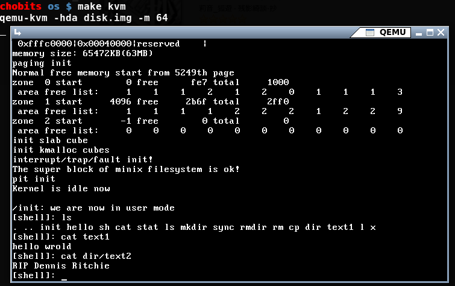

chos
====
 A monolithic 32-bit kernel.



Quick start
===========
```
  # make                <- compile and generate bootable disk image
  # make loaduser       <- install basic usermode programs into disk image
  # make [bochs|kvm]    <- run it in bochs or kvm
```

Debug
=====
```
  # make debug
  # gdb -q [boot/boot.elf | kernel.elf | user/*]
  ...
  # vim [boot/boot.asm | kernel.asm | user/*.asm]
  ...
  # grep "some symbol" [boot/boot.sym | kernel.sym | user/*.sym]
  ...
```

Documentation
=============
 See doc/*.txt
